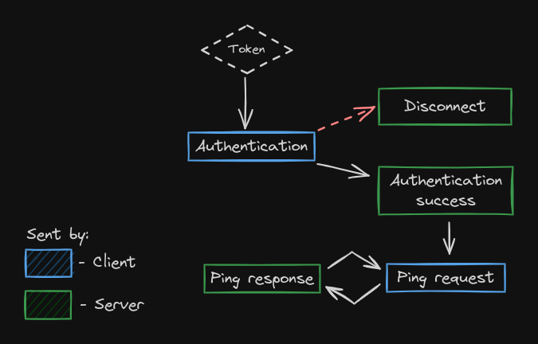

# Trivial Packet Protocol
[About](#About) | [Installation](#Installation) | [Usage](#Usage)

## About
Trivial Packet Protocol is a client and server library, allowing you to send binary data in the form of packets over network.  
It makes it easier to maintain a continuous stream between two or more pieces of software running on different machines.  
The library is designed to allow you to design a network flow, where you use string commands to occassionally request data from the server and listen for a binary response.

## Library features
- [x] 🪶 Simple, lightweight client - server structure
- [x] 📦 Zero required dependencies
- [x] 🔑 SSL support, using a Certificate and a Private Key
- [x] 🧩 Expandable - You can register and use your own packets
- [x] 📎 Secure - Requires a token on both ends before accepting any packets

## Use cases
This library is perfect for situations, where you need to occassionally request data from a server without opening a new connection every single time.  
Trivial Packet Protocol allows you to open and maintain a constant, protected, and encrypted connection between client(s) and a server.

## How does it work?
Trivial Packet Protocol uses **packets**. Each time one party wants to send a request, it sends a packet to the other. Likewise if the other party wants to respond to a request, it sends back another packet.  
Each party can **send** and **listen** for packets.
Sending and receiving is done **independently**, meaning you can both send and listen for packets at the same time\*, instead of following a strict request - response flow.

\* keep in mind, that while the library can be used concurrently to some extent, it's not guaranteed to be thread safe!

## The Protocol
The client starts by sending an `Authentication` packet with user-supplied token, which acts like a plain-text password.  
The server then compares the received token with its own, and if it matches it responds with `Authentication Success` packet, otherwise it disconnects the client with a `Disconnect` packet.  
After authentication is finished, both the server and the client are put in the reading mode.  
Both parties can send any packets at any time, and the other party is required to handle it correctly, but received packets don't need to be acknowledged.  
In default library implementation the client sends a `Ping` packet every 15 seconds and expects the server to reply to it in the near future.
If the client does not receive a `Ping` response before sending the next `Ping` packet, it disconnects with a "Timed Out" message.



## Requirements
Currently the only requirement to use the library is Java 17

## Installation
### From source
0. Make sure you have `git` and `maven` installed
1. `git clone https://github.com/Defective4/TrivialPacketFormat.git`
2. `cd TrivialPacketFormat`
3. `mvn clean package`

The compiled binaries will now be available in:
- Client: `packet-client/target`
- Server: `packet-server/target`  

Just include them in your classpath and you are good to go!

### From Maven
*Soon™* - waiting for publishing to maven central


## Usage
For more examples see [Examples](examples/src/main/java/io/github/defective4/trivialpacket/examples/).  

Simple client and server with an example command:
```java
public static void main(String[] args) {
    int port = 8080;
    String serverToken = "TOKEN";
    String clientToken = "TOKEN"; // You have to keep the two tokens the same for authorization to work

    new Thread(() -> {
        try (CmdServer server = new CmdServer("localhost", port, serverToken.toCharArray())) {
            server.addListener(new ServerAdapter() {

                @Override
                public void clientDisconnected(ClientConnection connection) throws Exception {
                    server.close();
                }

                @Override
                public void commandReceived(ClientConnection connection, String command, String[] args)
                        throws Exception {
                    connection
                            .respond(String
                                    .format("Command: %s, Arguments: [%s]", command, String.join(", ", args))
                                    .getBytes());
                }
            });

            server.start();
        } catch (Exception e) {
            e.printStackTrace();
        }
    }).start();

    try (CmdClient client = new CmdClient("localhost", port, clientToken.toCharArray())) {
        Thread.sleep(500);
        client.addListener(new ClientAdapter() {

            @Override
            public void authorized() throws Exception {
                client.sendCommand("echo", "Hello", "World");
            }

            @Override
            public void responseReceived(byte[] data) throws Exception {
                System.out.println(new String(data));
                client.disconnect("Disconnected");
            }

        });
        client.connect();
    } catch (Exception e2) {
        e2.printStackTrace();
    }
}
```

## Defining custom packets
See [CustomPacketExample.java](examples/src/main/java/io/github/defective4/trivialpacket/examples/CustomPacketExample.java) for a practical example. 

### Step 0 - Setting up client and server projects
Create two separate projects, one with `packet-client` dependency, and one with `packet-server`.

### Step 1 - Creating a custom Packet class
We will create a class that sends a single string from one end to another.  

Write the following class:
```java
package io.github.defective4.trivialpacket.common.packet;

public class ExamplePacket extends Packet {

    private final String string;

    public ExamplePacket(byte[] data) {
        super(data);
        this.string = new String(data);
    }

    public ExamplePacket(String string) {
        this(string.getBytes());
    }

    public String getString() {
        return string;
    }

}
```
and save it in **both** of your projects.  
Notice there are two constructors. The first one is for the **receiving** end, taking raw bytes and parsing them into our desired format.  
The second constructor is for **sending**. It takes our string and encodes it int raw bytes that can be sent over network.

### Step 2 - Registering the Packet
To use the packet we need to register it in the `PacketRegistry`.  
Here's an example code:
```java
PacketRegistry.registerNewPacket(ExamplePacket.class);
```
do it in both of your projects.  

### Step 3 - Use the packet

Code for the server:
```java
try(CmdServer server = new CmdServer("localhost", 8083, null)) {
    server.addListener(new ServerAdapter() {

        @Override
        public void customPacketReceived(ClientConnection connection, Packet packet) throws Exception {
            System.out.println("Received custom packet: " + packet.getClass());
            if (packet instanceof ExamplePacket example) {
                System.out.println(example.getString());
                connection.disconnect("Closed");
                server.close();
            }
        }

    });

    server.start();
}
```

Code for the client:
```java
try (CmdClient client = new CmdClient("localhost", 8083, null)) {
    client.addListener(new ClientAdapter() {

        @Override
        public void authorized() throws Exception {
            client.sendPacket(new ExamplePacket("Test String"));
        }

    });
    client.connect();
}
```